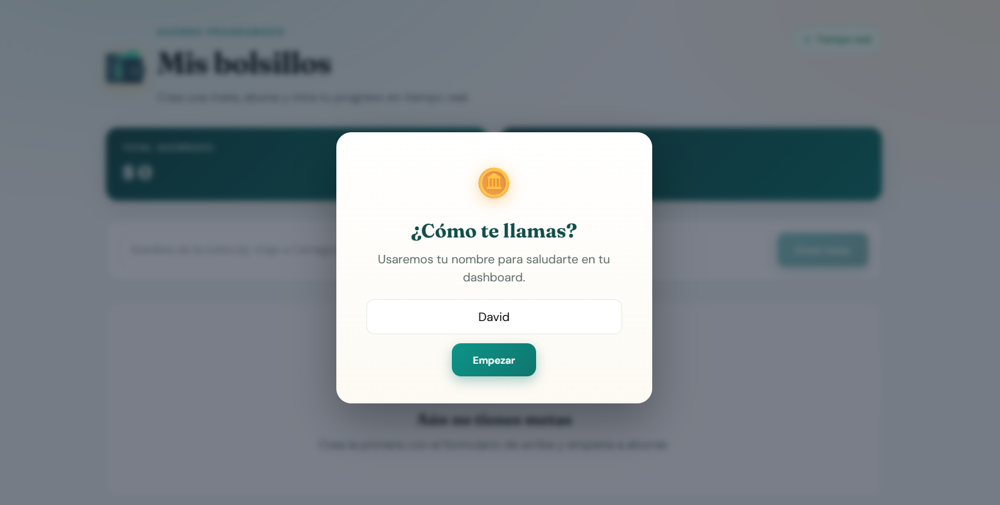
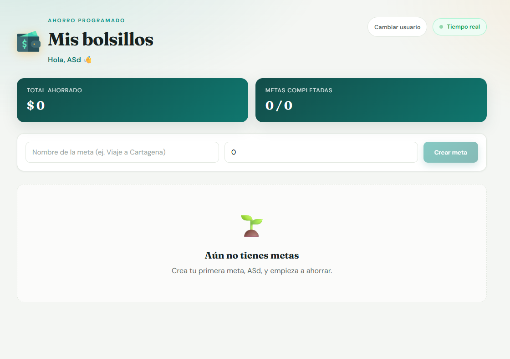
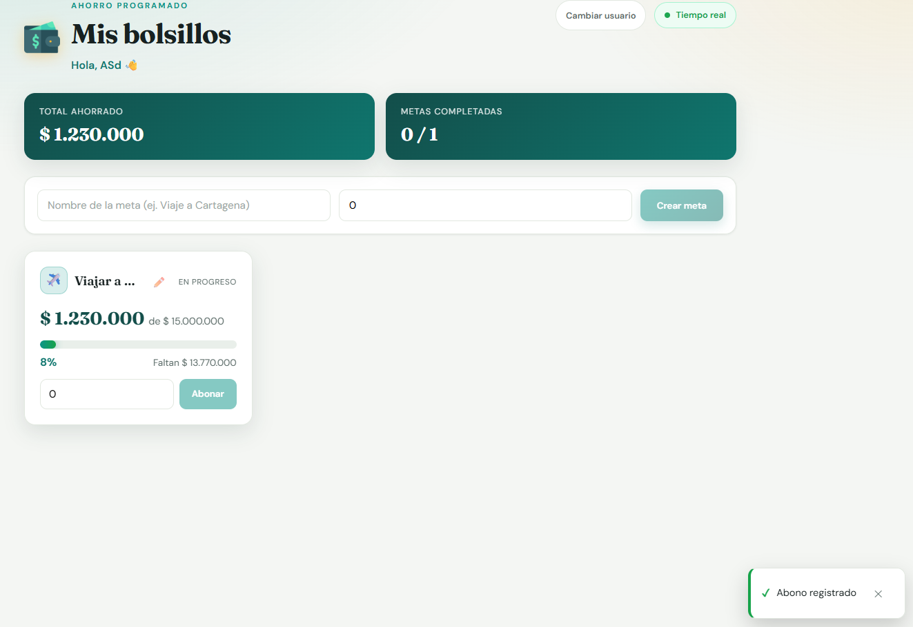
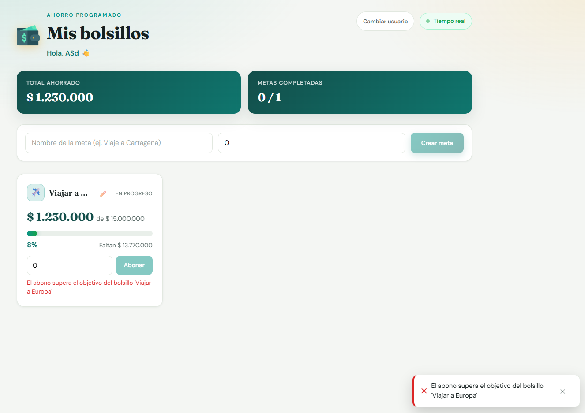
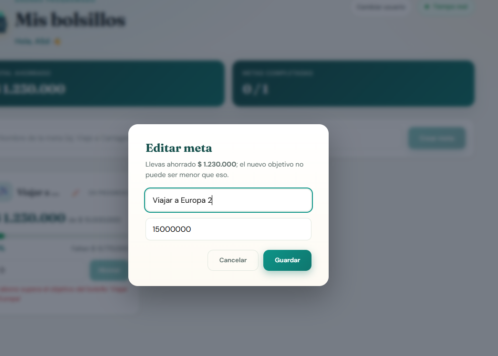
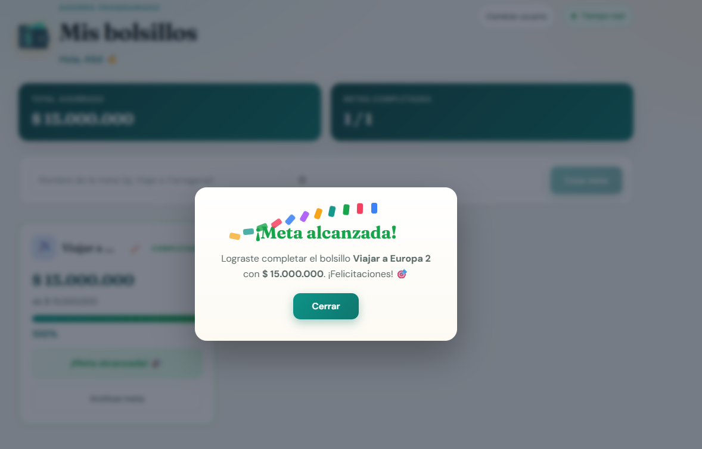

# Bolsillo de Ahorro Programado

**Savings Goal Wallet** — aplicación *full stack* para gestionar metas de ahorro: crea bolsillos,
registra abonos con validaciones de negocio y recibe notificaciones en tiempo real cuando una
meta llega al 100%.

> Proyecto de prueba técnica con sustentación en vivo. Se evalúa **criterio de ingeniería**:
> separación de responsabilidades, patrones de diseño, tipado estricto y estrategia de pruebas.
> La justificación arquitectónica y la gobernanza de IA viven en [`docs/`](docs/).

---

## ✨ Características

- **Dashboard de metas** con tarjetas que muestran nombre, monto objetivo, acumulado, %
  de progreso y estado, con actualización inmediata vía SSE.
- **Registro de abonos** con validaciones de negocio (monto > 0, no exceder el objetivo).
- **Notificación de meta alcanzada**: al completar el 100% se emite un evento especial que
  dispara un modal distintivo con confeti animado.
- **Edición de metas** (nombre y objetivo) respetando la invariante `objetivo >= acumulado`.
- **Archivado y restauración** de metas completadas (sección "Metas archivadas").
- **Identificación local** del usuario (nombre en `localStorage`) con saludo personalizado.
- **Moneda colombiana** (COP): formatos `$ 1.000.000` e inputs con incrementos de $100.
- **Toasts globales** de éxito/error y mensajes de validación accesibles (`aria-live`).
- **Accesibilidad** WCAG 2.2: skip link, labels, `aria-invalid`, `focus-visible`,
  `prefers-reduced-motion`, modales con `<dialog>` nativo (focus trap).

## 🛠️ Stack tecnológico

| Capa               | Tecnología                                                                 | Detalle |
|--------------------|----------------------------------------------------------------------------|---------|
| **Backend**        | ☕ Java 21 · 🍃 Spring Boot 3.2.5                                           | REST API |
| **Persistencia**   | 🗄️ H2 en memoria · Spring Data JPA                                          | Datos por sesión |
| **Tiempo real**    | 📡 SSE nativo (`SseEmitter` / `EventSource`)                                 | Push unidireccional |
| **Frontend**       | ⚡ Angular 21 (standalone) · Signals · Reactive Forms                        | SPA moderna |
| **Moneda**         | 💰 `Intl.NumberFormat('es-CO', COP)`                                         | Pipe `pesos` |
| **Tests backend**  | ✅ JUnit 5 · Mockito · `@WebMvcTest`/MockMvc                                 | 76 tests |
| **Tests frontend** | 🧪 Vitest · TestBed (Angular `unit-test` builder)                            | 94 tests |
| **Contenedores**   | 🐳 Docker multi-stage · docker-compose · nginx                               | `:80` + `:8080` |

**Arquitectura**: Hexagonal ligero (Ports & Adapters) — `domain` ← `application` ← `infrastructure`.

## 📸 Capturas

| Dashboard de metas | Formulario de creación |
|---------------------|------------------------|
|  |  |

| Tarjeta y registro de abono | Meta alcanzada (modal) |
|------------------------------|--------------------------|
|  |  |

| Metas archivadas | Edición de meta |
|------------------|------------------|
|  |  |

---

## 📁 Estructura del repositorio

```
examen-fullstack/
├── backend/                 # API hexagonal (Java 21 + Spring Boot 3)
│   └── src/main/java/com/bolsillo/
│       ├── domain/          # Entidades y reglas puras (Java sin Spring)
│       ├── application/     # Casos de uso + puertos (BolsilloRepository, NotificadorPort)
│       └── infrastructure/  # Adaptadores JPA, REST, SSE, config de beans
├── frontend/                # App Angular (signals + reactive forms)
│   └── src/app/
│       ├── core/            # Servicios HTTP/SSE, store, pipes, utilidades
│       └── features/bolsillos/  # Dashboard, tarjetas, modales
├── images/                  # Capturas de pantalla de la aplicación
├── docs/
│   ├── arquitectura.md      # Justificación, patrones y trade-offs
│   └── ia.md                # Gobernanza de IA (skills, agentes, bitácora)
├── docker-compose.yml
└── README.md
```

## ⚙️ Requisitos previos

- **Java 21** y **Maven** (o usa `./mvnw`)
- **Node.js ≥ 20** y **npm**
- **Docker** con docker-compose (opcional, para levantar todo junto)

## 🚀 Cómo ejecutar

### Opción 1 — Docker (todo junto)

```bash
docker compose up --build
```

| Servicio  | URL                     | Notas                                  |
|-----------|-------------------------|----------------------------------------|
| Frontend  | http://localhost        | nginx sirve el build + proxy `/api`    |
| Backend   | http://localhost:8080   | H2 en memoria, consola en `/h2-console`|

> Los tests **no** corren dentro del build de imagen (se ejecutan por separado).

### Opción 2 — Local (desarrollo)

```bash
# Backend (puerto 8080)
cd backend && ./mvnw spring-boot:run

# Frontend (puerto 4200, proxy /api → 8080)
cd frontend && npm install && npm start
# abre http://localhost:4200
```

## 🧪 Cómo correr las pruebas

```bash
cd backend && ./mvnw test     # 76 tests backend (JUnit 5 + Mockito + MockMvc)
cd frontend && npm test       # 94 tests frontend (Vitest + TestBed)
```

## 🔌 API

| Método | Ruta                            | Descripción                       |
|--------|---------------------------------|-----------------------------------|
| GET    | `/api/bolsillos`                | Lista metas activas               |
| GET    | `/api/bolsillos/archivados`     | Lista metas archivadas            |
| POST   | `/api/bolsillos`                | Crea una meta (nombre, objetivo)  |
| POST   | `/api/bolsillos/{id}/abonos`    | Abona a una meta (monto)          |
| PATCH  | `/api/bolsillos/{id}`           | Edita nombre/objetivo de una meta |
| PATCH  | `/api/bolsillos/{id}/archivar`  | Archiva una meta completada       |
| PATCH  | `/api/bolsillos/{id}/restaurar` | Restaura una meta archivada       |
| GET    | `/api/notificaciones`           | Stream SSE en tiempo real         |

**Eventos SSE**: `abono-registrado` y `meta-alcanzada` (payload = estado actualizado del bolsillo).

**Errores**: contrato uniforme `{ timestamp, status, message, errors? }` vía `@RestControllerAdvice`.

## 📐 Reglas de negocio

- Monto del abono debe ser **> 0** (se rechazan 0 y negativos).
- Un abono **no puede hacer que `acumulado > objetivo`**.
- Al alcanzar exactamente el **100%** se emite el evento especial `meta-alcanzada`.
- **Archivar** solo metas completadas; **editar** exige `nuevoObjetivo >= acumulado`.

## 🏗️ Arquitectura y patrones

**Hexagonal ligero (Ports & Adapters)**: el dominio es Java puro (sin Spring/JPA), los casos de
uso solo conocen puertos (`BolsilloRepository`, `NotificadorPort`) y la infraestructura mira
hacia adentro. Patrones implementados explícitamente:

- **Repository** — puerto `BolsilloRepository` + adaptador JPA (Spring Data).
- **Observer / Pub-Sub** — eventos de dominio (`AbonoRegistradoEvent`, `MetaAlcanzadaEvent`)
  publicados por el caso de uso y traducidos a SSE por un `@EventListener`.

Justificación completa, alternativas descartadas y trade-offs en
[`docs/arquitectura.md`](docs/arquitectura.md).

## 🤖 Gobernanza de IA

Skills (`/gen-test`) y agentes (`@test-writer`, `@arch-guard`) configurados en `.opencode/`,
con bitácora de co-creación (generado por IA vs. escrito a mano y correcciones aplicadas) en
[`docs/ia.md`](docs/ia.md).